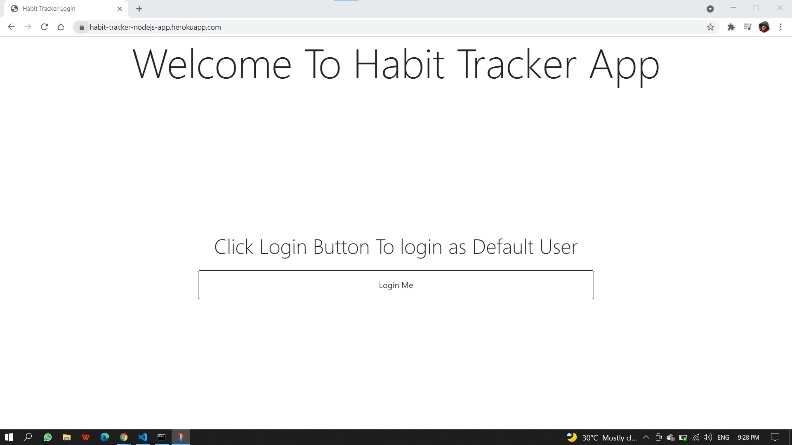
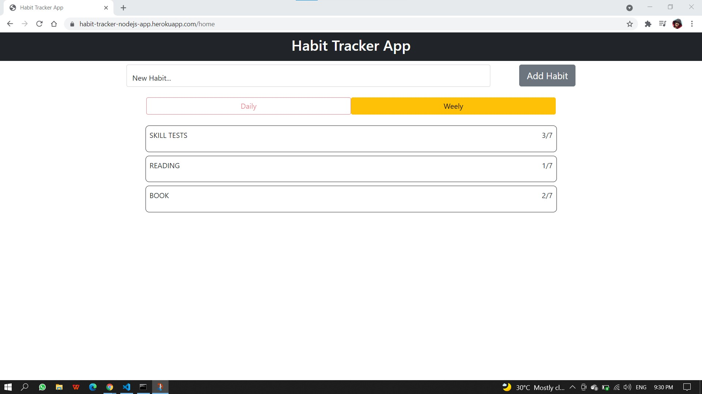
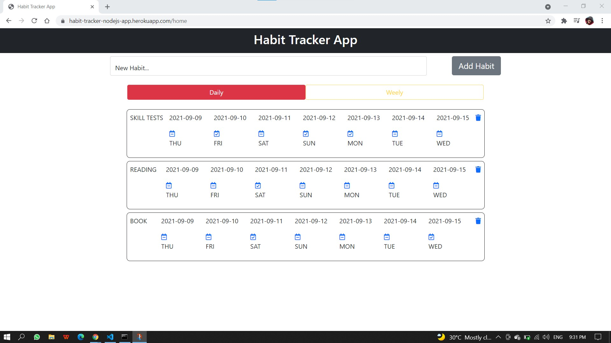

# Habit-Tracker-Node.js

## view this page at : https://habit-tracker-nodejs-app.herokuapp.com/

### Features
  * Track each habit everyday.These are the 3 statuses of a habit: 
    * Done - Mark the habit as done for a day
    * Not done - Mark the habit as not done for a day
    * None - User did not take any action on a habit for a day
  * Add new Habits 
  * View last 7 day's of habit tracker
  * Change status of last 7 days's
  * Track number of days the user coompleted the habits

### Previews
  * Login
    
  * Home (Daily View)
    
  * Home (Weekly View)
    
    
### Directory Structure
  `/assets/css` - all css files  
  `/config` - mongoDB config  
  `/controller` - all the controllers  
  `/models` - all the schems  
  `/router` - all the routers  
  `/views` - all the ejs code
  
